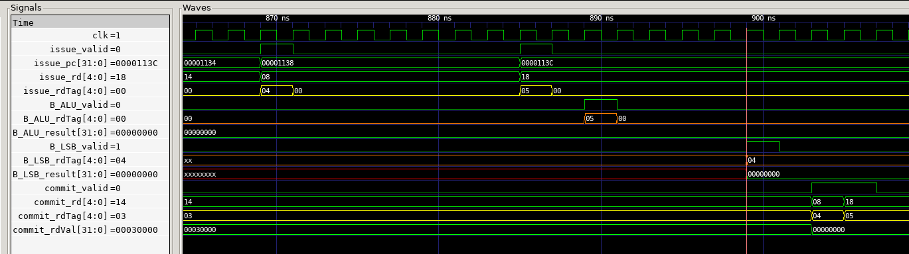

## Out of Order Execution

以第一个测试点array_test1为例说明我的CPU是如何乱序执行的。下面是CPU仿真运行测试点的波形图截图和部分汇编指令。



```assembly
1138:	000aa403          	lw	s0,0(s5)
113c:	00000c13          	li	s8,0
```

如上波形图所示，CPU按程序顺序先后发射了pc在1138和113C处的指令，对应的ROB Tag分别为4和5。其中1138处的`lw`指令进入LSB，113C处的`li`指令先进入RS再到ALU。

观察B_ALU和B_LSB的信号可知，虽然`li`指令发射在后，但ALU广播更早，即更早执行完毕，因此实现了乱序执行。最后则由ROB统一顺序提交。
