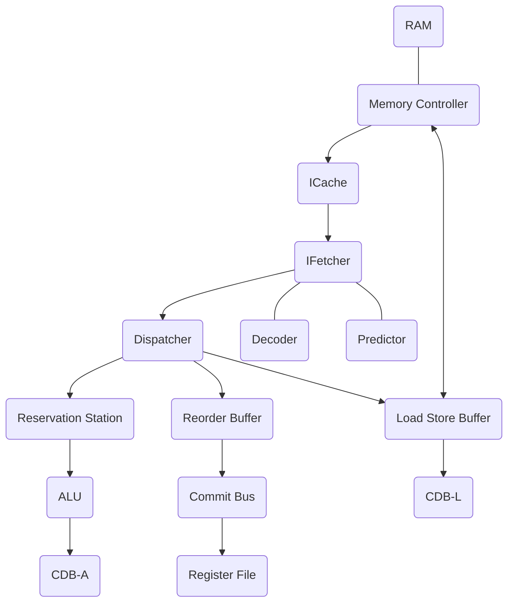
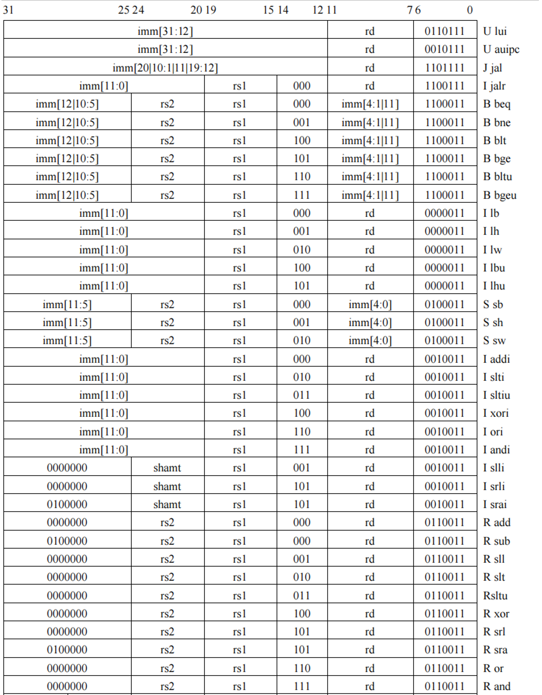

# RISC-V-CPU

[Project Introduction](https://github.com/ACMClassCourse-2022/RISC-V-CPU-2023)

## Design Graph

## Instruction Set

## FPGA Test

|testcase|time(s)|
|:-----:|:------:|
|array_test1|0.004642|
|array_test2|0.002847|
|basicopt1|0.012653|
|bulgarian|1.743403|
|expr|0.010825|
|gcd|0.015204|
|hanoi|3.460890|
|heart|550.602665|
|looper|0.001929|
|lvalue2|0.007145|
|magic|0.034581|
|manyarguments|0.005640|
|multiarray|0.015918|
|pi|1.857390|
|qsort|6.562402|
|queens|3.108229|
|statement_test|0.007033|
|superloop|0.015037|
|tak|0.039671|
|testsleep|7.006029|
|uartboom|0.788991|

**Note: Some testcases may need rewritten before running to obtain the correct results.**
