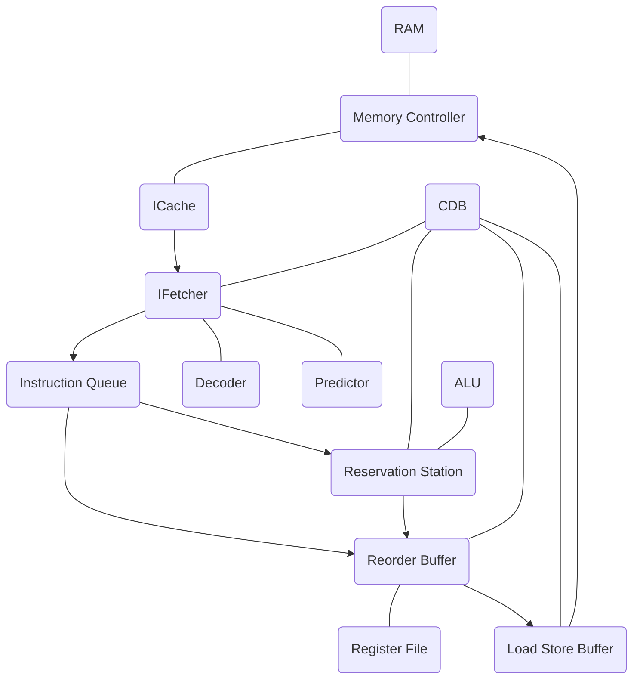

# RISC-V-CPU

[Project Introduction](https://github.com/ACMClassCourse-2022/RISC-V-CPU-2023)

## Design

```mermaid
flowchart TD
    A(RAM) --- B(Memory Controller)
    B --- C(ICache)
    C --> D(IFetcher) 
    D --> E(Instruction Queue)
    D --- M(Decoder)
    D --- L(Predictor)
    E --> F(Reservation Station)
    E --> G(Reorder Buffer)
    F --> G
    G --- H(Register File)
    G --> I(Load Store Buffer)
    I --> B
    J(CDB) --- G
    J --- F 
    J --- D 
    J --- I
    K(ALU) --- F
```
